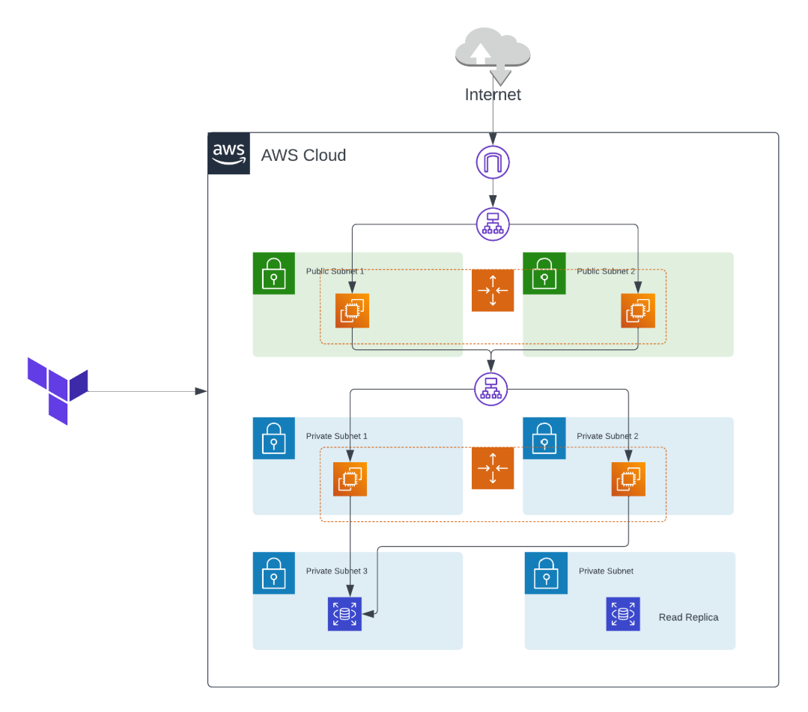

# Multi-Tier Architecture on AWS using Terraform

## Project Overview
### This project allows us to deploy a highly available, scalable, and secure multi-tier architecture on Amazon Web Services (AWS) using Terraform. The architecture consists of the following three tiers:

#### Web Tier: This tier handles incoming user requests and can be horizontally scaled for increased capacity. It typically includes web servers and a load balancer for distributing traffic.

#### Application Tier: Application servers run our business logic and interact with the database tier. They can also be horizontally scaled to meet demand.

#### Database Tier: The database stores and manages our application data. In this architecture, we use Amazon RDS for a managed database service.

